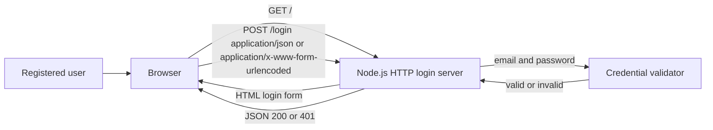

# Architecture

## 1. Overview

The human-approved implementation baseline is the dependency-free Node.js login service in `server.js`. It provides a server-rendered login form and a JSON login endpoint that validates credentials against a configured or injected validator. This documents repository evidence; it does not approve new dependencies, external providers, persistence, or product scope beyond the approved login requirements.

`src/index.js` is an unrelated Express Customer Order Service example. It is not imported by `server.js`, and Express is not declared in `package.json`; it is not part of this login architecture.

## 2. Architecture Diagram

No external authentication service, database, API, or deployment topology is evidenced.

## 3. Components

| Component | Concrete implementation | Traceability |
| --- | --- | --- |
| Login interface | Server-rendered HTML from `loginPage()` | FR-001, FR-002 |
| Login handler | `POST /login` in `createLoginServer()` | FR-002, FR-003, FR-004 |
| Credential validator | `createCredentialValidator()` or injected validator | FR-003, FR-004 |

## 4. Component Responsibilities

- The login interface renders required email and password inputs and a Login action.
- The login handler accepts both `application/json` and `application/x-www-form-urlencoded` request bodies, extracts email and password, and delegates credential verification. Invalid or missing fields return HTTP 400 with `{ "error": "Invalid email or password" }`; invalid credentials return HTTP 401 with `{ "error": "Invalid email or password" }`; valid credentials return HTTP 200 with `{ "message": "Login successful" }`. Unsupported content types return 415 and oversized bodies return 413, both using the same controlled JSON error contract.
- The credential validator uses strict equality against `LOGIN_EMAIL` and `LOGIN_PASSWORD`, or an injected validator. Missing default credentials prevent server creation.

## 5. Technology Choices

| Concern | Evidenced choice |
| --- | --- |
| Runtime | Node.js `>=18` |
| Entry point | `server.js` |
| HTTP server | Built-in `node:http` |
| UI | Server-rendered HTML strings |
| Request encoding | `application/json` and `application/x-www-form-urlencoded` |
| Response format for POST /login | `application/json` |
| Tests | Built-in `node:test` and `node:assert` via `npm test` |
| Dependencies | None declared |
| Credential source | `LOGIN_EMAIL` and `LOGIN_PASSWORD` environment variables, or test options |
| Containerization | Docker; `node:20-alpine` base image, working directory `/app`, port 3000 exposed, production entry via `npm start` |

## 6. Data Flow

1. A user requests `GET /` and receives the HTML login form.
2. The browser or client posts email and password to `POST /login` as JSON or URL-encoded form data.
3. The server checks content type and body size. Unsupported media type returns 415; oversized input returns 413; both use the controlled error contract.
4. The server extracts and validates email and password. Missing or malformed fields return 400.
5. The credential validator returns valid or invalid. Invalid credentials return 401 with `{ "error": "Invalid email or password" }`.
6. Valid credentials return HTTP 200 with `{ "message": "Login successful" }`.

## 7. Security

Evidenced controls are environment-configured default credentials, generic invalid-credential responses, controlled error responses for all failure paths, and uniform error messaging that does not distinguish between missing credentials and invalid credentials. `loginPage()` renders static HTML with no user-controlled content, so no runtime HTML escaping is required. (The `escapeHtml` helper previously present in `server.js` was dead code and has been removed.)

TLS/deployment configuration, password hashing or an identity provider, session management, CSRF protection, rate limiting, lockout, audit logging, secret rotation, and account authorization are `Not Found` in the approved requirements.

## 8. Architecture Decisions

| Decision | Status | Rationale |
| --- | --- | --- |
| Use the existing Node.js login service as the minimum baseline | Human approved | The approval authorizes existing repository conventions, not new behavior or dependencies. |
| Use built-in Node HTTP and test modules | Evidenced | `package.json`, `server.js`, and active tests show no declared dependencies. |
| Accept both application/json and application/x-www-form-urlencoded in POST /login | Evidenced | Aligns the backend handler with the rendered form submission path and JSON API clients. |
| Return JSON from POST /login for both success and failure | Evidenced | CR-001 remediation: aligns the login endpoint response contract with the approved success and error messages. |
| Exclude session management, /account, and /logout from the login scope | Evidenced | CR-002 remediation: out-of-scope logic removed; only FR-001 through FR-004 are in scope. |
| Exclude `src/index.js` from the login design | Evidenced | It is unrelated to the active entry point and has an undeclared dependency. |

## 9. Risks

| Risk | Impact | Limitation or decision gap |
| --- | --- | --- |
| Direct credential comparison | No user store or password-hash verification | Identity provider and password storage are `Not Found`. |
| No session management | Caller must manage post-login state | Post-login session, account access, and logout are outside the approved scope. |
| No evidenced CSRF, rate limit, lockout, or audit controls | Abuse protection and security-event handling are undefined | These controls are `Not Found`. |
| Current validation and error behavior exceeds story acceptance criteria | Future approved rules may differ | Human approval is needed before treating them as product requirements. |
