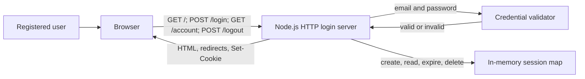

# Architecture

## 1. Overview

The human-approved implementation baseline is the existing dependency-free Node.js login service in `server.js`. It provides a server-rendered login form, configured credential validation, in-memory sessions, a protected account page, and logout. This documents repository evidence; it does not approve new dependencies, external providers, persistence, or product scope beyond the approved login requirements.

`src/index.js` is an unrelated Express Customer Order Service example. It is not imported by `server.js`, and Express is not declared in `package.json`; it is not part of this login architecture.

## 2. Architecture Diagram

No external authentication service, database, API, or deployment topology is evidenced.

## 3. Components

| Component | Concrete implementation | Traceability |
| --- | --- | --- |
| Login interface | Server-rendered HTML from `loginPage()` | FR-001, FR-002 |
| Login handler | `POST /login` in `createLoginServer()` | FR-002, FR-003, FR-004 |
| Credential validator | `createCredentialValidator()` or injected validator | FR-003, FR-004 |
| Session management | Per-server `Map`, UUID session ID, `session` cookie | Evidenced post-login behavior |
| Account handler | `GET /account` | FR-003 |
| Logout handler | `POST /logout` | Evidenced behavior outside US-001 |

## 4. Component Responsibilities

- The login interface renders required email and password inputs and a Login action. It renders errors in an element with `role="alert"` and does not render the submitted password.
- The login handler accepts URL-encoded form data, trims email, checks non-empty values and the local email pattern, and delegates credential verification. Invalid fields return HTTP 400; invalid credentials return HTTP 401.
- The credential validator uses strict equality against `LOGIN_EMAIL` and `LOGIN_PASSWORD`, or an injected validator. Missing default credentials prevent server creation.
- Session management stores an email and expiration time in memory. Valid credentials create a UUID session and redirect to `/account`; missing, malformed, expired, and unknown sessions are unauthenticated.
- The account handler displays the authenticated email or redirects unauthenticated users to `/`. The logout handler removes the session, expires the browser cookie, and redirects to `/`.

## 5. Technology Choices

| Concern | Evidenced choice |
| --- | --- |
| Runtime | Node.js `>=18` |
| Entry point | `server.js` |
| HTTP server | Built-in `node:http` |
| Session identifier | `node:crypto` `randomUUID()` |
| UI | Server-rendered HTML strings |
| Request encoding | `application/x-www-form-urlencoded` |
| Tests | Built-in `node:test` and `node:assert` via `npm test` |
| Dependencies | None declared |
| Credential source | `LOGIN_EMAIL` and `LOGIN_PASSWORD` environment variables, or test options |
| Session storage | In-memory JavaScript `Map` |

## 6. Data Flow

1. A user requests `GET /` and receives the login form.
2. The browser posts URL-encoded email and password to `POST /login`.
3. The server checks content type, body size, and local input rules. Invalid input returns 400, unsupported media type returns 415, and oversized input returns 413.
4. The credential validator returns valid or invalid. Invalid credentials return 401 with a generic message.
5. Valid credentials create an in-memory session with an expiration and return HTTP 303 to `/account` with a session cookie.
6. `GET /account` serves the account page for a valid session; otherwise it returns HTTP 303 to `/`. `POST /logout` deletes the session, expires the cookie, and returns HTTP 303 to `/`.

## 7. Security

Evidenced controls are environment-configured default credentials, UUID session identifiers, `HttpOnly`, `SameSite=Lax`, `Path=/`, and finite `Max-Age` cookie attributes, generic invalid-credential responses, HTML escaping, and expiry of server and browser session state on logout. The `Secure` cookie attribute is enabled only when `secureCookies: true` is configured.

TLS/deployment configuration, password hashing or an identity provider, durable session storage, CSRF protection, rate limiting, lockout, audit logging, secret rotation, session renewal, and account authorization are `Not Found` in the approved requirements.

## 8. Architecture Decisions

| Decision | Status | Rationale |
| --- | --- | --- |
| Use the existing Node.js login service as the minimum baseline | Human approved | The approval authorizes existing repository conventions, not new behavior or dependencies. |
| Use built-in Node HTTP, crypto, and test modules | Evidenced | `package.json`, `server.js`, and active tests show no declared dependencies. |
| Use server-rendered HTML and URL-encoded form submission | Evidenced | Implemented by `loginPage()` and `POST /login`. |
| Use configured direct credential comparison and in-memory sessions for this baseline | Evidenced | Implemented in `server.js`; not a production credential or persistence decision. |
| Exclude `src/index.js` from the login design | Evidenced | It is unrelated to the active entry point and has an undeclared dependency. |

## 9. Risks

| Risk | Impact | Limitation or decision gap |
| --- | --- | --- |
| Direct credential comparison | No user store or password-hash verification | Identity provider and password storage are `Not Found`. |
| In-memory sessions | Sessions are lost on restart and cannot be shared across instances | Durable/distributed session design is `Not Found`. |
| Optional `Secure` cookie | A deployment can omit the attribute | Production TLS and cookie policy are `Not Found`. |
| No evidenced CSRF, rate limit, lockout, or audit controls | Abuse protection and security-event handling are undefined | These controls are `Not Found`. |
| Current validation and error behavior exceeds story acceptance criteria | Future approved rules may differ | Human approval is needed before treating them as product requirements. |
